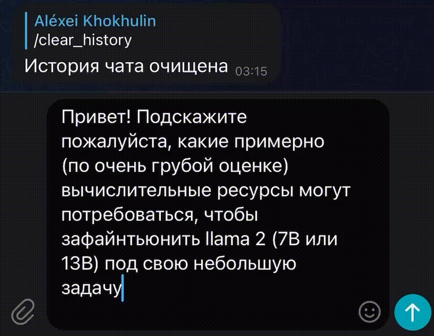

# Вступительное испытание на смену ML в Сириусе
Кейс по NLP
---

В рамках задания необходимо обучить свою диалоговую языковую модель и сделать телеграм бота для взаимодействия с ней.

В качестве данных я решил использовать диалоговые данные из публичного форума [better data community](https://t.me/betterdatacommunity). Данные в формате json были предобработаны с помощью предоставленного скрипта **prepare_data.py**. Для удобной работы с данными был создан класс ConversationDataset, выполняющий функции: токенизации, склеивания фраз из контекста в диалог, разъединенный специальными токенами `@@ПЕРВЫЙ@@` и `@@ВТОРОЙ@@`, а также создания датасета для обучения.

В качестве базовой модели была выбрана предложеннная в задании [**ruDialoGPT-medium**](https://huggingface.co/tinkoff-ai/ruDialoGPT-medium)

Для тюнинга модели была использована **peft** (Parameter-Efficient Fine-Tuning) - библиотека для эффективной адаптации предобученных моделей на новые задачи. А именно был использован метод [**LoRA**](https://arxiv.org/abs/2106.09685) (LoRA: Low-Rank Adaptation of Large Language Models) - это метод, заключающийся в представлении обновлений весов двумя матрицами меньшего размера (update matrices) с помощью low-rank decomposition. Эти новые матрицы могут быть обучены для адаптации к новым данным, при этом общее количество изменений остается минимальным. Исходная матрица весов остается "замороженной" и не подвергается дальнейшей корректировке. 

После обучения модели был создан интерфейс для модели с использованием FastAPI и обернут в Docker. Также был создан телеграм бот для взаимодействия с моделью. Бот был тоже обернут в Docker, для общения с моделью контейнеры были соединены bridge network. 

Модули были покрыты тестами с помощью pytest. 

### Запуск
Для взаимодействия с проектом был создан Makefile со следующими целями:
- `make build` - сборка контейнеров
- `make run` - запуск контейнеров
- `make stop` - остановка контейнеров
- `make test` - запуск тестов

Для запуска тестов и тюнига модели необходимо установить библиотеки из requirements.txt.

